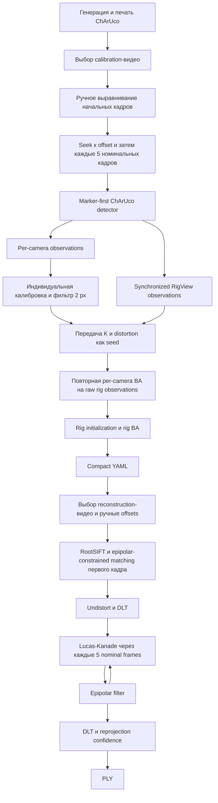

# Полный аудит пайплайна калибровки и 3D-реконструкции

> Дата аудита: 2026-07-20  
> Проект: `forma-veridica`  
> Ветка на момент аудита: `migrating-from-opencv`  
> HEAD на момент аудита: `7454d8664080ee41240c9820e13fba9ab8d05b2d` — `Add RootSIFT normalization and epipolar-constrained matching`  
> Основной эксперимент: `/home/watermelon0guy/Видео/Experiments/exp_1/`  
> Калибровка: `/home/watermelon0guy/Видео/Experiments/exp_1/exp_1.yaml`  
> Результаты реконструкции: `forma-veridica/point_clouds/`

> **Обновление (август 2026):** документ частично приведён в соответствие с текущим кодом (сверка чтением, без запуска).
> Основные изменения с момента аудита:
> - логика калибровки/реконструкции вынесена из GUI в `lib_pipeline/src/runner.rs` (`run_calibration`, `run_reconstruction`);
> - добавлены конфиги `CalibrationConfig`/`ReconstructionConfig` (`lib_pipeline/src/config.rs`) с `validate()` — параметры detection/dataset/solver/frame_step теперь в конфиге, а не хардкодом (дефолты прежние);
> - добавлен CLI `calibration_app run config.yaml output.yaml`;
> - видео-бэкенд заменён с `video-rs` на `ffmpeg-next`; исправлен unsigned underflow в `rewind_backward`;
> - square-size слайдер доски синхронизирован с конфигом (рассинхрон из 5.1 устранён);
> - offsets камер унифицированы (`CameraConfig` + `validate()` + `sync_offsets_from_players`).
> Устаревшие/частично устаревшие пункты помечены в тексте заметками «✅ Исправлено» / «🟡 Частично исправлено».

## Назначение этого документа

Этот файл фиксирует полный контекст аудита, чтобы в следующих сессиях не восстанавливать заново:

- фактический end-to-end путь данных;
- подтверждённые корректные части реализации;
- доказанные алгоритмические ошибки;
- условные проблемы и эксплуатационные ограничения;
- количественные результаты анализа `exp_1`;
- опровергнутые гипотезы;
- состояние тестов;
- рекомендуемый порядок исправлений и регрессионных тестов.

Аудит проводился без изменения алгоритмического кода. В ходе аудита создавались временные утилиты только в `/tmp`; после проверки они были удалены. Единственное изменение репозитория по итогам аудита — добавление данного документа.

До добавления документа рабочее дерево уже содержало незакоммиченные изменения:

```text
M reconstruction_app/src/ui/align_videos_screen.rs
M reconstruction_app/src/ui/pick_calibration_data.rs
M reconstruction_app/src/ui/pick_videos_screen.rs
M reconstruction_app/src/ui/process_screen.rs
?? point_clouds/
```

Изменения четырёх UI-файлов заменяют устаревший `CentralPanel::show_inside` на `CentralPanel::show`; аудит их не создавал и не изменял. Каталог `point_clouds/` содержит пользовательские результаты реконструкции.

---

# 1. Краткий итог

Пайплайн **не является полностью неправильным**. Для двух pinhole-камер согласованы:

- направление extrinsics;
- проекционные матрицы;
- фундаментальная матрица;
- distorted/undistorted координаты;
- RootSIFT;
- nominal correspondence ordering;
- стандартная DLT-триангуляция.

Текущие PLY-файлы `exp_1` численно целостны: в них нет `NaN`, бесконечностей или катастрофических пространственных выбросов.

Однако низкая training reprojection error сама по себе не гарантирует правильность калибровки. Обнаружены несколько проблем высокого приоритета:

1. Marker-first ChArUco detector имеет резкие провалы recall и неслучайно отбрасывает полезные положения доски.
2. Отфильтрованные индивидуальные intrinsics затем повторно оптимизируются на исходных нефильтрованных rig observations без robust loss.
3. Фактический PTS декодированного кадра игнорируется; синхронизация использует запрошенное время и номинальный FPS.
4. Нет автоматических quality gates для принятия калибровки.
5. UI способен сохранить паттерн с физическим размером квадрата, отличающимся от модели калибровки (исправлено, см. 5.1).
6. Matcher использует неправильный Lowe threshold для квадратов расстояний, допускает безусловные singleton matches и не обеспечивает mutual/one-to-one соответствия.
7. Optical flow игнорирует `TrackResult.status` и `error`.
8. SIFT запускается только в начале; точки могут только исчезать и никогда не пополняются.
9. Триангуляция не проверяет cheirality, triangulation angle и неопределённость глубины.
10. Реконструкция не выделяет целевой объект: облако содержит любые общие tracked features сцены.

Для `exp_1` наиболее вероятная картина следующая:

- калибровка в целом геометрически согласована, но intrinsics выглядят слабо обусловленными;
- reconstruction matching стал заметно лучше после RootSIFT и эпиполярного ограничения;
- переход с шага 20 кадров на 5 существенно улучшил Lucas–Kanade;
- на длинной последовательности треки необратимо вымирают, что напрямую видно по PLY;
- часть наблюдаемого пространственного «дрейфа» является survivor bias — остаётся всё более узкое и асимметричное подмножество точек.

---

# 2. Уровни уверенности и severity

В документе используются следующие категории.

## Уверенность

- **Подтверждено** — доказано исходным кодом/API и/или воспроизведено тестом.
- **Условно подтверждено** — кодовый дефект существует, но проявление зависит от данных или действий пользователя.
- **Риск/ограничение** — архитектурное ограничение, не обязательно проявившееся в `exp_1`.
- **Опровергнуто** — правдоподобная гипотеза, которую дополнительные тесты не подтвердили.

## Severity

- **Critical** — может тихо дать полностью неправильную метрическую геометрию или сделать основной сценарий недостоверным.
- **High** — существенно влияет на качество/стабильность и способен создавать правдоподобный, но неверный результат.
- **Medium** — заметно ухудшает надёжность, диагностику или отдельные свойства результата.
- **Low** — локальный дефект, UX-проблема или технический долг без значительного влияния на текущий результат.

---

# 3. Полный фактический путь данных



## 3.1. Активная генерация ChArUco

Default-конфигурация в `calibration_app/src/app.rs`:

```text
rows = 11
cols = 8
square_size_mm = 20.0
marker_size_rel = 0.55
dictionary = DICT_6X6_100
marker_layout = OpenCvCharuco
border_bits в UI state = 3
```

Важно: `CharucoTargetSpec::new` принимает `(rows, cols)`, поэтому `new(11, 8, ...)` означает вертикально 11 и горизонтально 8 квадратов.

## 3.2. Калибровочные observations

Для каждого выбранного временного шага строятся два набора данных.

### Per-camera dataset

`update_correspondes_views()` сохраняет detection каждой камеры независимо, если в нём минимум 8 точек.

Этот dataset используется для индивидуальной калибровки каждой камеры.

### Rig dataset

`update_rigs()` создаёт один `RigView`, если минимум две камеры имеют detection и каждое имеющееся detection содержит минимум 8 точек.

Для текущих двух камер это означает, что обе камеры должны успешно обнаружить доску в одном логическом временном шаге.

## 3.3. Индивидуальная калибровка

`calibrate_camera()` вызывает `vision-calibration` с `FilterOptions.max_reproj_error = 2.0`.

Пайплайн зависимости выполняет:

1. Zhang initialization;
2. nonlinear BA;
3. удаление точек с ошибкой выше 2 px;
4. удаление слишком пустых views;
5. повторную initialization и BA.

## 3.4. Rig calibration

`calibrate_multiple_with_inrinsics()` извлекает из индивидуальных результатов только:

- `FxFyCxCySkew`;
- `BrownConrady5`.

Затем выполняются:

```rust
step_intrinsics_init_all_with_seed(...)
step_intrinsics_optimize_all(...)
step_rig_init(...)
step_rig_optimize(...)
```

Индивидуально очищенные observations при этом не передаются.

## 3.5. Reconstruction

Первый кадр:

1. SIFT на обеих камерах;
2. RootSIFT;
3. top-10 KNN по descriptor;
4. фильтр по эпиполярной полосе 15 px;
5. Lowe ratio только при двух и более кандидатах;
6. сбор 2D correspondences;
7. undistortion;
8. DLT;
9. confidence по средней reprojection error;
10. PLY.

Следующие кадры:

1. переход на 5 nominal frames;
2. Lucas–Kanade отдельно по каждой камере;
3. undistortion;
4. эпиполярный фильтр 15 px;
5. DLT;
6. confidence;
7. PLY;
8. только прошедшие correspondences становятся входом следующего шага.

---

# 4. Подтверждённо корректные части

## 4.1. Extrinsics, projection matrices и фундаментальная матрица

`vision-calibration 0.7.0` экспортирует:

```text
cam_se3_rig[i] = T_Ci_R
```

то есть преобразование из rig frame в camera frame.

Следовательно, код корректно использует:

```text
P_i = K_i [R_i | t_i]
T_C1_C0 = T_C1_R · inverse(T_C0_R)
E = [t]_x R
F = inverse(K1)^T · E · inverse(K0)
```

Файлы:

- `lib_cv/src/reconstruction.rs:36-84`

Identity первой камеры полезна как gauge convention, но для самих формул не обязательна.

## 4.2. Undistortion

`PinholeCamera::backproject_pixel()`:

1. применяет `K⁻¹`;
2. учитывает sensor model;
3. инвертирует distortion;
4. возвращает ray point на плоскости `z=1`.

Поэтому:

```rust
let ray = camera.backproject_pixel(px);
let pixel = K * ray.point;
```

корректно даёт undistorted pixel coordinates для pinhole-модели.

Файлы:

- `lib_cv/src/reconstruction.rs:144-160`
- `reconstruction_app/src/app.rs:159-163, 216-225`

## 4.3. Distorted/undistorted data flow

Корректно:

- SIFT работает по исходным изображениям;
- Lucas–Kanade работает в distorted coordinates исходных кадров;
- цвет берётся по distorted coordinates;
- F и DLT используют undistorted coordinates.

## 4.4. RootSIFT

`root_sift_normalize()` делает:

1. L1-нормализацию;
2. поэлементный `sqrt`.

Дескрипторы `sift-wgpu 0.1.0` неотрицательны, поэтому реализация соответствует RootSIFT.

Файл:

- `lib_cv/src/reconstruction.rs:323-336`

## 4.5. DLT

Строки:

```text
P.row(0) − u P.row(2)
P.row(1) − v P.row(2)
```

эквивалентны стандартной DLT-форме с точностью до знака. Последняя строка `Vᵀ` соответствует минимальному singular value.

Файл:

- `lib_cv/src/reconstruction.rs:235-302`

## 4.6. Точность успешно принятых ChArUco corners

На одинаковых PNG-кадрах Rust marker-first сравнивался с OpenCV 5.0.0.

Для общих corner ID:

- средняя разница: `0.0085…0.0167 px`;
- максимальная разница: `0.0743 px`.

Следовательно, успешно принятые IDs и pixel coordinates соответствуют OpenCV практически идеально. Основной дефект custom detector — recall, а не точность уже принятых углов.

---

# 5. Генерация и физический масштаб паттерна

## 5.1. Несинхронизированный square-size slider

> ✅ **Исправлено (2026-08):** поле `app.charuco_square_size` удалено; слайдер пишет прямо в `calibration_config.charuco_board.square_size_mm` (`calibration_app/src/ui/charuco_board_screen.rs:51-59`), а preview и сохранение PNG читают то же поле (`:124-132`, `:95-103`). Рассинхрон невозможен.

**Статус: подтверждено**  
**Severity: Critical при изменении размера пользователем**

Слайдер изменяет:

```rust
app.charuco_square_size
```

Файл:

- `calibration_app/src/ui/charuco_board_screen.rs:47-53`

Но preview и сохранение PNG используют:

```rust
app.charuco_target_spec.square_size_mm
```

Синхронизация выполняется только в:

- `calibration_app/src/app.rs:136-139`

после нажатия «Продолжить», которое сразу переводит пользователя на другой экран.

### Сценарий ошибки

1. Начальное значение — 20 мм.
2. Пользователь ставит 40 мм.
3. Сохраняет PNG — он всё ещё рассчитан как 20 мм.
4. Нажимает «Продолжить» — calibration board становится 40 мм.
5. Reprojection error остаётся хорошей.
6. Baseline и все translations масштабируются примерно в 2 раза.

Если пользователь не менял default `20 мм`, этот дефект не влияет на конкретный `exp_1`.

## 5.2. Потеря `pHYs`/DPI при сохранении

**Статус: подтверждено по API**  
**Severity: Medium/High**

`calib-targets-print` создаёт `bundle.png_bytes` и записывает physical pixel dimensions через PNG `pHYs`.

Приложение:

1. декодирует PNG в `DynamicImage`;
2. повторно кодирует через `save_with_format`.

Файлы:

- `calibration_app/src/app.rs:191-203`
- `calibration_app/src/ui/charuco_board_screen.rs:101-108`

`DynamicImage` не сохраняет исходный `pHYs`, а используемый путь записи не восстанавливает его.

Следствие: программа печати может масштабировать изображение по собственному DPI или выполнить fit-to-page. Reprojection error этого не обнаружит; изменится только метрический масштаб translations.

Правильнее сохранять исходные `bundle.png_bytes` без decode/re-encode.

## 5.3. `border_bits = 3` фактически теряется

**Статус: подтверждено, но активного рассогласования нет**  
**Severity: Low/Medium, provenance/configuration**

Default state задаёт:

```rust
.with_border_bits(3)
```

Но активный renderer получает:

```rust
CharucoTargetSpec::to_board_spec()
PrintableTargetDocument::from_charuco_board_spec_mm(...)
```

`CharucoBoardSpec` не содержит `border_bits`, а `from_board_spec_mm()` восстанавливает default `border_bits = 1`.

Detector также жёстко использует `border_bits = 1`.

Итог:

- PNG, созданный активным приложением, фактически имеет border 1;
- текущий detector ожидает border 1;
- активного mismatch нет;
- однако UI state и фактический target расходятся;
- внешний target с настоящим border 3 текущий detector может распознавать неправильно.

## 5.4. Размер страницы рассчитан правильно

Промежуточная гипотеза о перепутанных `rows/cols` была опровергнута.

`CharucoTargetSpec::new(11, 8, ...)` означает:

```text
rows = 11
cols = 8
```

Поэтому custom page:

```text
width = 8 × 20 + 2 × 10 = 180 мм
height = 11 × 20 + 2 × 10 = 240 мм
```

соответствует доске. Ошибка `BoardDoesNotFit`, полученная в одном временном тесте, была вызвана намеренно перепутанными размерами тестовой страницы `240×180`, а не кодом проекта.

## 5.5. Legacy `generate_calibration_pattern`

> 🟡 **Частично исправлено (2026-08):** crate по-прежнему закомментирован в `workspace.members` и не добавлен в `workspace.exclude`, но его `Cargo.toml` уже не зависит от `opencv` (зависимости: `lib_cv`, `eframe`, `serde`, `rfd`) и код больше не импортирует `opencv`. Утверждение «импортирует opencv без зависимости» устарело; компилируемость чтением не проверялась.

Отдельный crate `generate_calibration_pattern` сейчас не является рабочим:

- он закомментирован в `workspace.members`;
- не добавлен в `workspace.exclude`;
- `cargo test --manifest-path generate_calibration_pattern/Cargo.toml` завершается ошибкой «package believes it's in a workspace when it's not»;
- код импортирует `opencv`, но dependency `opencv` отсутствует в его `Cargo.toml`.

Он не участвует в текущем активном pipeline, но не должен восприниматься как готовая альтернатива.

---

# 6. ChArUco/Aruco detector

## 6.1. Подтверждённый scale cliff после refinement

> 🟡 **Частично исправлено (2026-08):** `win_size` больше не хардкод — теперь берётся из конфига `refine_window_px` (default 5, `lib_cv/src/calibration/params.rs:35`) и настраивается в UI (`calibration_app/src/ui/advanced_params.rs:50-56`). Структурные проблемы пайплайна (порядок этапов, median size filter, дедупликация) остались; приведённые ниже измерения не перепроверялись.

**Статус: подтверждено синтетически**  
**Severity: High**

Идеальная штатная доска была уменьшена и помещена по центру кадра `1280×800`.

| Высота страницы в кадре | Размер квадрата | Найдено quad | Raw decoder | Итоговый marker-first | Grid-first |
|---:|---:|---:|---:|---:|---:|
| 240 px | 20.0 px | 137 | 0 | 0/0 | 27 маркеров / 70 углов |
| 360 px | 30.0 px | 157 | 0 | 0/0 | 27/70 |
| 480 px | 40.0 px | 212 | 32 | 0/0 | 27/70 |
| 600 px | 50.0 px | 216 | 44 | 0/0 | на этом synthetic scale grid-first также сорвался |
| 720 px | 60.0 px | 254 | 44 | 0/0 | 27/70 |
| 800 px | 66.7 px | 258 | 44 | 43 маркера / 66 углов | 27/70 |

Ключевой факт: при квадрате 40–60 px raw decoder уже распознаёт 32–44 маркера, но после текущего refinement остаётся ноль.

Текущий порядок:

```text
find_marker_quads
→ dedup
→ border filter
→ refine_corner_lines
→ refine_corner с фиксированным win_size=5
→ size filter
→ scan_decode
```

Файлы:

- `lib_cv/src/calibration/charuco.rs:243-353`
- `lib_cv/src/calibration/charuco.rs:275-283`
- `lib_cv/src/calibration/charuco.rs:665-752`

Наиболее вероятный механизм — фиксированное окно `11×11` (`win_size=5`) для маленького маркера захватывает внутренние payload edges и сдвигает углы. `refine_corner_lines` также может вносить вклад; отдельно эти два приватных этапа в ходе аудита не изолировались.

## 6.2. Реальная сверка с OpenCV

Были извлечены восемь фиксированных PNG-кадров из calibration-видео. Один и тот же PNG подавался в текущий Rust detector и OpenCV ChArUco.

| Кадр | OpenCV markers/corners | Rust markers/corners | Общие углы | Средняя разница | Максимальная разница |
|---|---:|---:|---:|---:|---:|
| C1 ~9 с | 17/22 | 14/18 | 18 | 0.0113 px | 0.0311 px |
| C1 ~13 с | 28/40 | 0/0 | 0 | — | — |
| C1 ~50 с | 23/30 | 22/28 | 26 | 0.0109 px | 0.0615 px |
| C1 ~98 с | 25/37 | 23/33 | 33 | 0.0133 px | 0.0743 px |
| C2 ~9 с | 24/35 | 23/34 | 34 | 0.0167 px | 0.0614 px |
| C2 ~43 с | 30/45 | 30/45 | 45 | 0.0085 px | 0.0272 px |
| C2 ~58 с | 31/48 | 31/48 | 48 | 0.0107 px | 0.0415 px |
| C2 ~98 с | 24/35 | 7/6 | 6 | 0.0166 px | 0.0552 px |

Вывод:

- координаты и IDs принятых углов корректны;
- recall может внезапно падать с десятков углов до нуля или шести;
- нестабильность проявляется на реальных данных, а не только на synthetic target.

## 6.3. Локализация провалов на реальных кадрах

Для тех же кадров сравнивались raw quads/raw decoder и финальный detector.

| Кадр | Quads | Raw markers | Final markers/corners | OpenCV markers/corners |
|---|---:|---:|---:|---:|
| C1 ~9 с | 108 | 14 | 14/18 | 17/22 |
| C1 ~13 с | 47 | 5 | 0/0 | 28/40 |
| C1 ~50 с | 161 | 24 | 22/28 | 23/30 |
| C1 ~98 с | 138 | 25 | 23/33 | 25/37 |
| C2 ~9 с | 102 | 21 | 23/34 | 24/35 |
| C2 ~43 с | 117 | 29 | 30/45 | 30/45 |
| C2 ~58 с | 143 | 31 | 31/48 | 31/48 |
| C2 ~98 с | 42 | 7 | 7/6 | 24/35 |

Здесь видны два независимых источника потерь:

1. C1 ~13 с и C2 ~98 с уже на этапе quad candidates/raw decoding значительно уступают OpenCV.
2. На C1 ~13 с refinement дополнительно уничтожает оставшиеся 5 raw markers.

## 6.4. Adaptive threshold использует радиус, а не полный размер окна

**Статус: подтверждено по API**  
**Severity: Medium/High**

Код:

```rust
for win_size in [13, 23] {
    adaptive_threshold(gray, win_size, 7)
}
```

Файл:

- `lib_cv/src/calibration/charuco.rs:839-840`

`imageproc::adaptive_threshold` принимает `block_radius`, поэтому фактические окна равны:

```text
2 × 13 + 1 = 27
2 × 23 + 1 = 47
```

Это не эквивалент typical OpenCV sweep 3, 13, 23 и ухудшает кандидаты на малых маркерах/неравномерном освещении.

## 6.5. Глобальный median size filter

**Статус: подтверждено как хрупкая эвристика**  
**Severity: High для dataset selection**

Перед decoding вычисляется медианный perimeter всех quad, затем сохраняется только диапазон:

```text
0.6 × median … 1.4 × median
```

Файл:

- `lib_cv/src/calibration/charuco.rs:301-327`

В медиану входят:

- шахматные клетки;
- внешние/внутренние marker contours;
- payload contours;
- фоновые quad;
- кандидаты обоих threshold scales.

Следствия:

- корректные markers могут отбрасываться из-за содержимого фона;
- под перспективой удаляется ближняя или дальняя часть доски;
- полезные tilted poses проходят хуже;
- итоговый calibration dataset получает систематический spatial/pose bias.

## 6.6. `dedup_quads` выбирает первый, а не лучший contour

**Статус: риск, подтверждённый кодом**  
**Severity: Medium**

`dedup_quads()` сравнивает центры и сохраняет первый встретившийся quad.

Файл:

- `lib_cv/src/calibration/charuco.rs:50-87`

Не учитываются:

- decoding score;
- border score;
- corner fit residual;
- внешний/внутренний contour;
- лучший perimeter/shape quality.

Вложенный или неудачный contour первого threshold scale может вытеснить правильную внешнюю рамку.

## 6.7. Дедупликация marker IDs выполняется по chunks

**Статус: подтверждено кодом**  
**Severity: Medium**

`scan_decode_markers_in_cells()` вызывается отдельно для каждого `par_chunks(32)`.

Файл:

- `lib_cv/src/calibration/charuco.rs:348-351`

Опция `dedup_by_id` действует внутри одного вызова, но одинаковый ID из разных chunks может выжить. Затем:

- `build_marker_homographies()` сохраняет одну homography в `HashMap<u32, Homography>`;
- corner filtering всё ещё видит полный список дубликатов.

Это создаёт зависимость от порядка candidates.

## 6.8. Максимальная correction capacity словаря

**Статус: риск, подтверждённый кодом**  
**Severity: Medium**

Matcher создаётся с:

```rust
Matcher::new(*dict, dict.max_correction_bits())
```

Файл:

- `lib_cv/src/calibration/charuco.rs:299`

Для `DICT_6X6_100` это разрешает все доступные correction bits. OpenCV default errorCorrectionRate обычно консервативнее. При шумном или неправильно выделенном quad увеличивается шанс ложного ID.

## 6.9. Off-board markers участвуют в `checkBoard`

**Статус: подтверждено кодом**  
**Severity: Medium**

При поиске «чужого» маркера перебираются все decoded markers, включая ID, отсутствующие на текущей доске.

Файл:

- `lib_cv/src/calibration/charuco.rs:551-568`

Посторонний реальный ArUco или false decode рядом с доской может удалить корректный ChArUco corner.

## 6.10. Fallback line fitting возвращает линию неправильной ориентации

**Статус: подтверждено кодом, редкий путь**  
**Severity: Low/Medium**

В `fit_line_lsq()` fallback для вырожденного denominator в ветви horizontal/vertical возвращает линию противоположной ориентации.

Файл:

- `lib_cv/src/calibration/charuco.rs:777-813`

В нормальных невырожденных contours этот путь редок, но при коротких или плохо сгруппированных сторонах может резко сместить refined corner.

## 6.11. Rotation marker-а не стала подтверждённой критической ошибкой

Код действительно не использует `MarkerDetection.rotation` в `build_marker_homographies()`.

Изначально это выглядело как High-severity ошибка. Дополнительные тесты показали:

- чистый поворот 90°: средняя ошибка около 0.004 px, максимум 0.012 px;
- 180°: около 0.004 px, максимум 0.015 px;
- 270°: около 0.004 px, максимум 0.013 px;
- сильный projective warp с rotation: средняя ошибка около 0.149 px, максимум 0.260 px.

Вероятно, ошибка локальной ориентации почти компенсируется усреднением projections от двух диагонально расположенных parent markers. На реальных принятых corners OpenCV-сверка также не выявила ID/orientation error.

Итог: это возможный небольшой perspective-dependent bias, но не основная причина плохой калибровки.

---

# 7. Видео, PTS и синхронизация

## 7.1. `VideoPlayer` хранит requested state вместо фактического decoded state

> 🟡 **Частично исправлено (2026-08):** видео-бэкенд заменён с `video-rs` на `ffmpeg-next` (`lib_cv/src/video.rs`), ссылки на video-rs API устарели. Суть проблемы осталась: `decode_next_frame` не читает PTS декодированного кадра (`lib_cv/src/video.rs:197-217`), а `seek_to_time` присваивает requested значения (`:129-130`). Сам код признаёт допуск seek ±1 секунду (`:15-16`).

**Статус: подтверждено**  
**Severity: High**

`video-rs::Decoder::decode()` возвращает:

```rust
(Time, Frame)
```

Код выбрасывает `Time`:

- `lib_cv/src/video.rs:83-90`

После `seek()` устанавливаются requested values:

- `lib_cv/src/video.rs:61-79`

Следовательно:

```text
current_frame
current_time_in_seconds
```

могут не соответствовать фактическому декодированному PTS и показываемому изображению.

Документация `video-rs::Reader::seek()` гарантирует только позицию в пределах ±1 секунды от target. На текущем MJPEG фактическое поведение намного лучше, но точное попадание всё равно не гарантируется.

## 7.2. Измеренный seek error на `exp_1`

Была создана временная Rust-утилита с тем же алгоритмом:

```text
requested frame
→ frame / decoder.frame_rate()
→ milliseconds
→ decoder.seek()
→ decoder.decode()
→ сравнение returned Time с requested time
```

| Видео | Samples | Mean absolute error | Max error | Ошибок больше 1 frame |
|---|---:|---:|---:|---:|
| `exp_1_board_C1.avi` | 2665 | 4.424 ms | 133.723 ms | 563 |
| `exp_1_board_C2.avi` | 2674 | 4.220 ms | 142.153 ms | 554 |
| `exp_1_C1.avi` | 12698 | 3.110 ms | 165.518 ms | 549 |
| `exp_C2.avi` | 12604 | 3.024 ms | 198.524 ms | 542 |

Средняя ошибка невелика, но редкие gaps достигают:

- calibration: примерно 16–17 nominal frames;
- reconstruction: примерно 20–24 nominal frames.

## 7.3. Метаданные видео

Все четыре AVI:

- codec: Motion JPEG Baseline;
- resolution: `1280×800`;
- pixel format: `yuvj422p`;
- nominal `r_frame_rate = 120/1`;
- `avg_frame_rate ≈ 120.00048`;
- audio streams отсутствуют.

| Видео | Duration | `nb_frames` metadata | Реальные packets/decoded frames | Дефицит nominal slots |
|---|---:|---:|---:|---:|
| `exp_1_C1.avi` | 529.064550 s | 63488 | 54449 | 9039 = 14.237% |
| `exp_C2.avi` | 525.164566 s | 63020 | 54063 | 8957 = 14.213% |
| `exp_1_board_C1.avi` | 111.041223 s | 13325 | 8751 packets | 4574 = 34.326% |
| `exp_1_board_C2.avi` | 111.416221 s | 13370 | 8797 packets | 4573 = 34.203% |

Это не обрезанные хвосты: PTS шкала доходит до заявленного конца, а gaps расположены внутри потока.

Максимальные PTS gaps:

- reconstruction C1: 183.3 ms;
- reconstruction C2: 216.7 ms;
- calibration C1/C2: 150 ms.

## 7.4. Raw PTS overlap между камерами

Без неизвестных UI offsets:

### Reconstruction

```text
общих PTS: 45555
только C1: 8894
только C2: 8508
Jaccard: 0.723589
```

### Calibration

```text
общих PTS: 5370
только C1: 3381
только C2: 3427
Jaccard: 0.440959
```

Это не является прямой оценкой фактической синхронизации после ручных offsets, но показывает, что availability timeline камер различается.

## 7.5. Модель выборки каждые 5 nominal frames

При поиске следующего доступного packet:

### Reconstruction, 12518 временных шагов

```text
точный slot есть у обеих камер: 9070
только у одной: 3365
нет у обеих: 83
median skew: 0 ticks
p95: 1 tick
p99: 11 ticks
max: 24 ticks = 200 ms
```

### Calibration, 2665 временных шагов

```text
точный slot есть у обеих камер: 1082
только у одной: 1352
нет у обеих: 231
median/p95 skew: 1 tick = 8.33 ms
p99: около 10.4 ticks
max: 17 ticks = 141.7 ms
```

Эта модель не воспроизводит неизвестные UI offsets и внутреннюю точную политику FFmpeg для каждого seek, но подтверждает возможность intermittent temporal skew.

## 7.6. Разные FPS гарантированно создают drift

**Статус: подтверждено математически, не проявляется на текущих одинаковых nominal FPS**  
**Severity: High для общего случая**

Каждая камера продвигается на 5 своих кадров:

```text
t_i(n) = offset_i + 5n / fps_i
```

При 30 и 25 FPS ошибка растёт линейно и достигает 1 секунды после 30 шагов.

Нужен единый target timestamp и выбор ближайшего фактического PTS, а не одинаковое число кадров.

## 7.7. Unsigned underflow и неверные границы перемотки

> 🟡 **Частично исправлено (2026-08):** underflow устранён — `rewind_backward` проверяет `amount < current_frame` ДО вычитания (`lib_cv/src/video.rs:111-120`), а `total_frames == 0` обрабатывается ранним return (`:98-100`). Остались строгие границы (с frame 1 нельзя перейти на frame 0; нельзя перейти на последний кадр) и несоответствие слайдера `0.0..=duration` диапазону `seek_to_time` `[0, duration)`.

**Статус: подтверждено кодом**  
**Severity: Medium для надёжности**

`rewind_backward()` вычисляет:

```rust
self.current_frame - amount
```

до проверки. Если `amount > current_frame`:

- debug build может panic;
- release build может wrap around.

Дополнительно:

- с frame 1 нельзя перейти на frame 0 из-за условия `> 0`;
- нельзя перейти на последний кадр из-за `< total_frames - 1`;
- `total_frames - 1` underflow при metadata `frames() == 0`;
- slider допускает `time == duration`, но `seek_to_time()` принимает только `[0, duration)`.

Файл:

- `lib_cv/src/video.rs:39-79`

## 7.8. Последний валидный calibration sample отбрасывается

В calibration loop текущие изображения сначала собираются, затем все players пытаются перейти вперёд. Набор добавляется только если переход вперёд успешен для всех.

Файл:

- `calibration_app/src/app.rs:237-258`

Поэтому последний полный набор кадров перед EOF не используется. Для очень короткого видео это способно удалить единственный sample.

## 7.9. Offsets не валидируются одинаково

> ✅ **Исправлено (2026-08):** offsets унифицированы через `CameraConfig.start_time_in_seconds` с `validate()` в обоих конфигах (`lib_pipeline/src/config.rs:89-91, 196-198`) и `sync_offsets_from_players` (`calibration_app/src/app.rs:175-184`, `reconstruction_app/src/app.rs:134-143`). Калибровка и реконструкция применяют offsets одинаково с propagate ошибки (`lib_pipeline/src/runner.rs:41-46, 134-138`).

- Calibration обращается к `offsets[i]` без проверки длины и может panic.
- Reconstruction молча оставляет камеры без offset на нулевом времени.

Файлы:

- `calibration_app/src/app.rs:227-230`
- `reconstruction_app/src/app.rs:139-144`

---

# 8. Calibration dataset и solver

## 8.1. Индивидуальная фильтрация не переносится в rig calibration

**Статус: подтверждено исходниками `vision-calibration 0.7.0`**  
**Severity: High**

Индивидуальный pipeline фильтрует точки с error > 2 px, но возвращает только camera parameters.

Rig pipeline получает отдельно сформированные raw observations и повторно выполняет per-camera BA:

```rust
step_intrinsics_optimize_all(...)
```

Этот этап освобождает:

- `fx`, `fy`, `cx`, `cy`;
- `k1`, `k2`, `p1`, `p2`;
- per-view target poses.

`k3` по default остаётся фиксированным.

Robust loss по default:

```text
RobustLoss::None
```

После этого финальная rig BA по default фиксирует intrinsics и оптимизирует:

- extrinsics нереференсных камер;
- все `rig_se3_target`.

Следствие: финальные intrinsics соответствуют raw overlap subset, а не индивидуально очищенному полному dataset.

## 8.2. Минимальные admission criteria слишком слабы

> 🟡 **Частично исправлено (2026-08):** параметры admission (`min_corners_per_view`, `min_cameras_per_frame`) теперь настраиваемы в UI (`calibration_app/src/ui/advanced_params.rs:95-114`) и проверяются в `validate()` (`lib_pipeline/src/config.rs:55-61`). Сами критерии (spatial distribution, coverage, pose novelty, blur) не добавлены.

В приложении достаточно:

- 8 detected corners до calibration;
- минимум 3 views и 4 точки на view по API зависимости.

Не проверяются:

- spatial distribution углов;
- coverage краёв;
- pose novelty;
- наклоны по двум осям;
- диапазон размеров доски;
- blur;
- overlap diversity.

## 8.3. Fixed-cadence sampling создаёт много коррелированных views

Каждый пятый nominal frame при 120 FPS — примерно 24 samples/s.

Движение доски обычно намного медленнее, поэтому многие observations почти идентичны.

Для `exp_1`:

- медианный translation step между сохранёнными rig poses: 1.096 мм;
- медианный rotation step: 0.260°;
- q01 step равен нулю;
- имеются практически повторяющиеся poses.

Большое число residuals не эквивалентно большому числу независимых геометрических условий.

## 8.4. Rig overlap для N>2

`update_rigs()` допускает любые две видимые камеры, но linear rig initialization зависимости требует direct overlap каждой камеры с reference camera.

Кроме того, если у третьей камеры имеется слабое detection менее 8 точек, текущий код отбрасывает весь frame, даже если cam0+cam1 имеют хорошие observations.

Для текущих двух камер это не влияет, но ограничивает заявленную multi-camera calibration.

## 8.5. UI принимает любой `Ok`

Нет порога по:

- global mean error;
- per-camera error;
- p95/max;
- number of retained observations;
- solver improvement/convergence;
- positive-depth ratio;
- plausibility intrinsics/distortion;
- baseline.

Файл:

- `calibration_app/src/ui/calibration_screen.rs:18-70`

## 8.6. Reprojection mean может быть обманчив

Training mean:

- вычисляется на тех же данных, которые оптимизировались;
- взвешивается числом observations;
- может скрывать плохую sparse camera/view;
- не измеряет parameter uncertainty;
- не измеряет устойчивость к подвыборке кадров;
- не гарантирует метрический масштаб;
- не выявляет focal-distance degeneracy;
- не выявляет camera order/resolution mismatch downstream.

По исходникам зависимости, failed projections могут не попадать в итоговый mean так же, как успешные residuals. Подробные residual records способны это показать, но текущий compact save их удаляет.

---

# 9. Сериализация, metadata и воспроизводимость

## 9.1. Что сохраняется

В compact YAML остаются:

- `K` и Brown–Conrady5 каждой камеры;
- `cam_se3_rig`;
- `rig_se3_target`;
- global mean error;
- per-camera mean errors;
- solver report.

## 9.2. Что удаляется

`save_calibration_to_yaml()` очищает:

```text
per_feature_residuals
image_manifest
```

Файл:

- `lib_cv/src/calibration.rs:382-405`

Причина удаления `per_feature_residuals` понятна: `serde_yml` имеет жёсткий лимит sequence length 65536. Текущий text preprocessing при загрузке старых файлов решает практическую проблему больших YAML.

Но вместе с residuals теряются:

- tails распределения ошибок;
- spatial patterns;
- failed projection records;
- per-view outliers;
- возможность независимой диагностики.

## 9.3. Чего никогда не сохраняется

> 🟡 **Частично исправлено (2026-08):** появился сохраняемый `CalibrationConfig` (`lib_pipeline/src/config.rs:7-16`), который сериализует `charuco_board` (включая `border_bits`), `cameras` (video_path + start_time_in_seconds), `frame_step`, `detection`, `dataset`, `solver`. Конфиг сохраняется из UI (`align_videos_screen.rs:120-131`) и загружается CLI (`main.rs:49-65`). По-прежнему не сохраняются в результате калибровки: camera serial/ID, разрешение, crop/ROI, фактические PTS, напечатанный размер, версии зависимостей, число observations.

- board rows/cols;
- square size и единицы;
- marker ratio/dictionary/layout;
- фактически напечатанный размер;
- camera serial/ID;
- camera order;
- source filenames;
- frame width/height;
- crop/ROI;
- offsets;
- фактические PTS;
- sampling step;
- detector thresholds;
- число observations до/после filtering;
- dependency/config versions.

Это делает точное воспроизведение calibration run невозможным.

---

# 10. Фактические параметры `exp_1.yaml`

## 10.1. Общая структура

Измерено:

```text
размер файла: 290527 bytes
kind: rig_extrinsics
камер: 2
cam_se3_rig: 2
rig_se3_target: 1280
per_feature_residuals: {}
```

## 10.2. Reprojection errors

```text
global mean: 0.360050991943 px
camera 0: 0.421021723384 px
camera 1: 0.320697774580 px
```

Camera 0 error выше camera 1 примерно на 31.3%.

Global mean не является простым средним двух camera means, вероятно из-за взвешивания observations.

## 10.3. Intrinsics

| Параметр | Camera 0 / C1 | Camera 1 / C2 |
|---|---:|---:|
| `fx` | 8500.198852 | 8554.228487 |
| `fy` | 8494.269582 | 8534.165936 |
| `fx/fy` | 1.000698 | 1.002351 |
| `cx` | 1050.174357 | 975.907889 |
| `cy` | -206.590653 | -27.980558 |
| приблизительный horizontal FOV | 8.585° | 8.538° |
| приблизительный vertical FOV | 5.358° | 5.347° |

Относительно центра `1280×800`, `(639.5, 399.5)`:

```text
C1 principal point offset: (+410.674, -606.091) px
C2 principal point offset: (+336.408, -427.481) px
```

Оба principal points находятся выше изображения.

Это подозрительно для полного обычного сенсора, но может быть физически корректно при:

- смещённом ROI большого сенсора;
- intrinsics в системе полного сенсора;
- off-axis optics.

YAML не содержит metadata, позволяющей различить эти случаи.

## 10.4. Distortion

### Camera 0

```text
k1 = -0.353769
k2 = -0.075454
k3 = 0
p1 = 0.007533
p2 = -0.003596
```

### Camera 1

```text
k1 = -0.401899
k2 = +4.857157
k3 = 0
p1 = 0.002244
p2 = 0.003237
```

Несмотря на большое `k2` C2, фактическое displacement по области `1280×800` небольшое из-за `f ≈ 8500` и малых normalized radii.

Оценка displacement:

| | Median | p95 | Max |
|---|---:|---:|---:|
| C1 | 1.048 px | 5.343 px | 9.356 px |
| C2 | 1.450 px | 6.055 px | 9.013 px |

Большой `k2` скорее выглядит как слабо идентифицируемый компенсирующий параметр, коррелирующий с focal/principal point/k1, а не как взрывная distortion.

## 10.5. Extrinsics

Camera 0:

```text
identity rotation
translation = (0, 0, 0)
```

Camera 1:

```text
quaternion = (-0.026509, -0.470144, 0.878541, -0.080175)
translation = (-157.294, 1221.452, 697.766) мм
baseline norm = 1415.473 мм
full rotation angle = 170.803°
```

Rotation:

```text
det(R) = 1
max orthogonality error ≈ 4.44e-16
```

Camera 1 center в rig frame:

```text
(71.678, 1265.305, 630.420) мм
```

Угол между optical axes около `56.184°`. Большой full quaternion angle в основном связан с roll/переворотом камеры.

Геометрия правдоподобна для камер, расположенных вокруг рабочей зоны, но была бы подозрительна для небольшой параллельной stereo-пары.

## 10.6. Распределение `rig_se3_target`

Все 1280 quaternions нормированы.

### Translation

| Ось | Min | Median | Max | Std |
|---|---:|---:|---:|---:|
| X | -214.770 | -151.910 | -93.936 | 25.946 |
| Y | -76.298 | 17.588 | 83.026 | 35.974 |
| Z | 1271.204 | 1322.740 | 1371.694 | 26.654 |

Translation norm:

```text
min = 1281.765 мм
median = 1332.578 мм
max = 1378.184 мм
```

Глубинное разнообразие около 100.5 мм при дистанции примерно 1.33 м — умеренное.

### Rotation

```text
angle from identity:
min = 11.236°
median = 37.723°
max = 66.436°

angle from mean orientation:
median = 19.669°
max = 36.787°
```

### Последовательные steps

```text
translation step:
median = 1.096 мм
p95 = 6.421 мм
p99 = 31.736 мм
max = 112.844 мм между 676→677

rotation step:
median = 0.260°
p95 = 2.360°
p99 = 6.385°
max = 30.171°, также 676→677
```

Есть повторяющиеся/почти повторяющиеся poses.

## 10.7. Условная проекция default-доски

При предположении actual target = default 11×8, 20 мм:

- camera 0: около 69.0% внутренних углов геометрически внутри изображения;
- camera 1: около 81.4%;
- median visible corners: 49 и 58;
- все 1280 poses имеют минимум 8 геометрически видимых внутренних точек.

Покрытие camera 0 заметно смещено к верхней части изображения. Это способно ухудшить определение principal point/distortion.

Это условная проверка: board spec в YAML не сохранён.

---

# 11. Matching первого reconstruction-кадра

## 11.1. Неправильный Lowe threshold для squared distances

**Статус: подтверждено**  
**Severity: High для повторяющейся текстуры**

`kiddo::SquaredEuclidean` возвращает:

```text
D = ||a - b||²
```

Код сравнивает:

```rust
D1 < 0.75 * D2
```

Файлы:

- `lib_cv/src/reconstruction.rs:387-402`
- `lib_cv/src/reconstruction.rs:693-721`

Для classical Lowe ratio 0.75 необходимо:

```text
D1 < 0.75² × D2 = 0.5625 × D2
```

Текущий фактический threshold по обычному Euclidean distance:

```text
sqrt(0.75) ≈ 0.866
```

То есть фильтр существенно мягче заявленного.

## 11.2. Singleton candidate принимается без descriptor-quality gate

**Статус: подтверждено**  
**Severity: High**

Алгоритм:

1. top-10 nearest descriptors;
2. фильтр по epipolar distance;
3. если осталось >=2 — ratio test;
4. если остался 1 — безусловно принять.

Файл:

- `lib_cv/src/reconstruction.rs:702-734`

Нет:

- absolute descriptor threshold;
- mutual nearest check;
- uniqueness assignment.

Очень плохой descriptor способен пройти, если является единственным top-10 кандидатом внутри широкой полосы 15 px.

## 11.3. Top-10 preselection может потерять правильный epipolar match

Epipolar filter применяется после top-10 descriptor KNN. Правильный геометрический match с descriptor rank 11+ никогда не рассматривается.

Это trade-off производительности, но на повторяющихся витках может уменьшать recall.

## 11.4. Нет mutual и one-to-one matching

**Статус: подтверждено**  
**Severity: High**

Каждый target descriptor независимо выбирает ref descriptor. Несколько `cam_idx` могут выбрать один `ref_idx`.

`gather_points_2d_from_matches()` затем сохраняет первый match по порядку `cam_idx`, а не match с минимальным `FeatureMatch.distance`:

- `lib_cv/src/reconstruction.rs:474-482`

Формулировка «произвольный из-за HashMap» была уточнена: выбор детерминирован порядком обхода, но всё равно не оптимален.

Комментарий у старой `match_first_camera_features_to_all()`, обещающий взаимную проверку, не соответствует реализации.

## 11.5. Односторонняя epipolar distance

`epipolar_distance()` измеряет расстояние только от point camera 1 до линии из point camera 0.

Файл:

- `lib_cv/src/reconstruction.rs:86-94`

Нет:

- symmetric epipolar distance;
- Sampson distance;
- finite/zero denominator guard.

При zero denominator результат становится non-finite и обычно отбрасывается сравнением, но это неявное поведение.

## 11.6. Fixed threshold 15 px

Calibration mean около 0.36 px, а matching/tracking допускают 15 px.

15 px можно использовать как coarse gate только при наличии последующей строгой независимой проверки descriptor/geometric quality. В текущем singleton path такой проверки нет.

---

# 12. Optical flow и жизненный цикл tracks

## 12.1. Игнорируется `TrackResult.status`

**Статус: подтверждено по API `optical-flow-lk 0.3.1`**  
**Severity: High/Critical для длинной последовательности**

API возвращает:

```rust
TrackResult {
    pos,
    status,
    error,
}
```

Статусы:

- `Tracked`;
- `OutOfBounds`;
- `Diverged`;
- `LowTexture`;
- `FbInconsistent` для FB API.

Код сохраняет только `pos`:

- `lib_cv/src/reconstruction.rs:606-620`

`error` — mean photometric residual в 8-bit intensity units — также игнорируется.

## 12.2. In-bounds проверка только логируется

Код считает число точек внутри кадра, но не фильтрует их:

- `lib_cv/src/reconstruction.rs:622-631`

## 12.3. Нет forward-backward check

Используется `calc_optical_flow_ex`, а не `calc_optical_flow_fb`.

Forward-backward inconsistency является сильным сигналом:

- occlusion;
- feature switch;
- drift;
- divergence.

## 12.4. Epipolar geometry не заменяет LK status

Ошибочная/stale пара может продолжать удовлетворять F, особенно если обе камеры оставили старые coordinates или ошибка произошла вдоль epipolar line.

Низкая DLT reprojection error также не гарантирует, что tracked feature сохранил физическую идентичность.

## 12.5. Точки необратимо исчезают

После каждого шага:

```rust
prev_points = new_points;
```

где `new_points` уже отфильтрован по epipolar gate.

Файл:

- `reconstruction_app/src/app.rs:223-250`

Новых SIFT features больше никогда не добавляется. Нет:

- periodic re-detection;
- track reseeding;
- merge новых/старых tracks;
- min track count trigger.

## 12.6. Low-confidence 3D tracks продолжают жить

`filter_point_cloud_by_confidence()` фильтрует только текущий PLY cloud, но не corresponding 2D tracks.

Поэтому observations, удалённые из файла из-за плохой 3D reprojection, всё равно могут перейти в следующий optical-flow шаг, если прошли epipolar filter.

Это иногда позволяет track восстановиться, но также продолжает плохие correspondences.

---

# 13. Triangulation и confidence

## 13.1. Нет cheirality

**Статус: подтверждено**  
**Severity: High**

После DLT проверяется только:

```text
|w| >= 1e-12
```

Не проверяется:

```text
(R_i X + t_i).z > 0
```

для всех камер.

Точка за камерой может иметь почти нулевую reprojection error и confidence около 1.

## 13.2. Нет triangulation-angle/parallax gate

Малый угол между rays создаёт огромную depth uncertainty. При этом reprojection residual может быть нулевым.

Нужны как минимум:

- positive depth;
- minimum ray angle;
- sensible depth range;
- SVD singular-value gap/conditioning;
- sensitivity к pixel perturbation.

## 13.3. `confidence` не является confidence положения

Текущая формула:

```text
confidence = 1 - min(avg_reprojection_error / 5 px, 1)
```

Файл:

- `lib_cv/src/reconstruction.rs:231-290`

Не учитываются:

- descriptor distance;
- Lowe margin;
- epipolar distance;
- LK status/error;
- forward-backward error;
- cheirality;
- ray angle;
- depth uncertainty;
- calibration covariance.

Название `confidence` вводит в заблуждение: это только линейно преобразованная in-sample reprojection error.

## 13.4. DLT не нормализуется и не уточняется nonlinear refinement

Linear DLT является корректным initial estimate, но нет:

- normalized image coordinates/ray triangulation;
- minimization geometric reprojection error;
- robust multi-view residual.

Для текущих f64 и двух камер это не главный дефект, но влияет на точность и uncertainty.

## 13.5. Не проверяются одинаковые длины point lists

`triangulate_points_multiple()` берёт `num_points = points_2d[0].len()`, но не проверяет длины остальных камер.

Короткий список вызывает panic; длинный список частично игнорируется.

## 13.6. DLT skip нарушает correspondence цветов

**Статус: подтверждено кодом**  
**Severity: Medium для цвета**

Если `w ≈ 0`, точка пропускается и output vector уплотняется. Исходный observation index не сохраняется.

`add_color_to_point_cloud()` затем использует плотный index cloud point для исходного массива 2D points.

После первого skip все последующие цвета могут быть сдвинуты.

Файлы:

- `lib_cv/src/reconstruction.rs:263-300`
- `lib_cv/src/reconstruction.rs:520-526`

## 13.7. Negative coordinates при color lookup

Coordinates преобразуются в `u32` до явной проверки `x >= 0`, `y >= 0`. В современных Rust float-to-int cast saturates, поэтому отрицательная coordinate может стать `0` и получить цвет граничного pixel, а не остаться без цвета.

Это низкоприоритетная ошибка output coloring.

---

# 14. Концептуальные ограничения реконструкции

## 14.1. Нет object segmentation

Pipeline реконструирует любые общие features:

- объект;
- крепления;
- фон;
- блики;
- элементы стенда.

Нет:

- ROI;
- foreground/background segmentation;
- motion mask;
- semantic mask;
- проверки движения вместе с объектом.

Следовательно, PLY нельзя автоматически интерпретировать как поверхность эпоксидной пружины. Это облако общих features, которые прошли matching/tracking/geometry.

## 14.2. Общая видимость двух противоположных камер ограничена физически

Камеры смотрят с разных сторон. Многие surface points видимы только одной камере из-за occlusion. Даже идеальный matcher не сможет получить dense reconstruction невидимых с обеих сторон точек.

Повторяющаяся текстура витков дополнительно делает descriptor correspondence неоднозначным.

## 14.3. Нет track IDs в output

`PointContainer.track_id` существует, но не назначается и не сохраняется в PLY.

Из PLY невозможно надёжно понять:

- какая точка соответствует какой в следующем файле;
- track age;
- момент reinitialization;
- lineage после filtering.

Это затрудняет интерпретацию движения и отделение drift от реальной деформации.

---

# 15. Поддержка нескольких камер

## 15.1. Reconstruction принимает 3+ cameras и затем panic

**Статус: подтверждено**  
**Severity: High, не влияет на текущий двухкамерный `exp_1`**

`run_pipeline_in_thread()` принимает любое `num_cameras >= 2`.

Но:

- `compute_fundamental_matrix()` assert-ит ровно 2 камеры;
- `filter_matches_by_epipolar()` assert-ит ровно 2 point lists;
- одна F была бы неверно использована для всех `cam_i` даже без assert.

Файлы:

- `reconstruction_app/src/app.rs:125-151`
- `lib_cv/src/reconstruction.rs:62-66`
- `lib_cv/src/reconstruction.rs:102-115`

## 15.2. Panic worker может создать бесконечный цикл перезапусков

При `TryRecvError::Disconnected` UI очищает `pipeline_thread` и receiver, но не сохраняет ошибку.

На следующем UI frame startup condition снова запускает pipeline.

Файл:

- `reconstruction_app/src/ui/process_screen.rs:9-36`

Аналогичный lifecycle risk есть в calibration UI.

## 15.3. `min_visible_match_set` требует visibility во всех cameras

Для N камер сохраняются только ref features, присутствующие во всех остальных cameras.

В реальном multi-camera setup с occlusions разумнее требовать минимум две камеры и triangulate variable-view subsets.

---

# 16. Camera/order/resolution contract

## 16.1. Camera order не фиксируется

Порядок камер определяется порядком файлов, возвращённым file picker.

В reconstruction тот же векторный index применяется к calibration cameras без camera identity check.

Перестановка C1/C2 проходит все UI-проверки и полностью ломает F/undistortion/triangulation.

## 16.2. Resolution/crop не проверяются

Calibration `K` относится к конкретной pixel coordinate system.

Downscale, crop или ROI shift требуют преобразования `K`. Сейчас проверяется только число видео.

## 16.3. Scheimpflug export условно принимается как pinhole

`RigExtrinsicsExport` может содержать `sensors: Some(...)` для Scheimpflug.

Reconstruction игнорирует `sensors` и использует pinhole `K[R|t]`/`backproject` path.

Текущий calibration app создаёт pinhole export, поэтому `exp_1` не затронут. Внешний Scheimpflug YAML был бы обработан неверно без сообщения.

---

# 17. UI и lifecycle проблемы

## 17.1. Calibration retry после ошибки может быть заблокирован

При возврате к setup `calibration_error` не очищается. Startup condition требует `calibration_error.is_none()`, поэтому новый calibration thread может не запуститься.

Файлы:

- `calibration_app/src/ui/calibration_screen.rs:10-16, 25-30, 73-80`

## 17.2. VideoPlayer cache может сохранить старые файлы

`init_videos()` сразу возвращает `Ok`, если `video_players` непуст.

Если пользователь сменил paths, старые players/textures могут остаться.

Файлы:

- `calibration_app/src/app.rs:102-105`
- `reconstruction_app/src/app.rs:76-79`

## 17.3. Partial reconstruction initialization

Reconstruction добавляет players непосредственно в поля приложения. Если второй файл не открылся, первый уже остаётся. Следующий вызов видит непустой vector и считает initialization завершённой.

Файл:

- `reconstruction_app/src/app.rs:76-89`

## 17.4. Zero matches считается успешной reconstruction

Если matching дал ноль correspondences:

- DLT возвращает пустой vector;
- сохраняется валидный PLY с `element vertex 0`;
- pipeline возвращает `Ok(())`;
- UI показывает «Реконструкция завершена».

Нет minimum point count quality gate.

## 17.5. Output directory не очищается

`point_clouds/frame_N.ply` перезаписываются с нуля, но старый хвост от более длинного run остаётся.

Нужен run-specific каталог или manifest/очистка с явным подтверждением.

## 17.6. Timestamp не соответствует source frame/PTS

`PointCloud.timestamp` — порядковый номер output sample, а не source frame и не PTS. В PLY timestamp вообще не сохраняется.

Это делает временную интерпретацию неоднозначной.

---

# 18. Эмпирический анализ `point_clouds/`

## 18.1. Целостность

```text
PLY files: 12518
indices: 0…12517 без пропусков
общий размер: 30475689 bytes
всего points: 360400
parse errors: 0
header/row count mismatch: 0
NaN: 0
Inf: 0
RGB вне 0…255: 0
confidence вне 0…1: 0
пустых PLY: 0
```

Все PLY:

```text
format ascii 1.0
properties: x y z red green blue confidence
```

Все RGB grayscale: `R = G = B`, что соответствует grayscale-видео.

## 18.2. Количество точек

```text
min = 13
q25 = 18
median = 22
mean = 28.791
q75 = 32
q90 = 50.3
q95 = 65
q99 = 116
max = 301
std = 19.557
```

```text
frames with <20 points: 3793
frames with >=100 points: 209
frames with >=200 points: 6
```

Первые кадры:

```text
frame 0: 301
frame 1: 271
frame 2: 242
frame 3: 233
frame 4: 213
frame 5: 208
```

## 18.3. Динамика по десятым серии

| Десятая | Mean points | Median points | Median XYZ, мм |
|---:|---:|---:|---|
| 1 | 75.388 | 65 | (-81.29, 91.34, 1313.33) |
| 2 | 39.401 | 40 | (-89.96, 94.80, 1313.33) |
| 3 | 31.419 | 32 | (-91.31, 95.36, 1311.05) |
| 4 | 27.290 | 27 | (-93.91, 97.36, 1309.85) |
| 5 | 23.807 | 24 | (-101.44, 99.59, 1310.71) |
| 6 | 21.890 | 22 | (-107.32, 106.92, 1311.77) |
| 7 | 20.383 | 20 | (-114.75, 112.33, 1312.92) |
| 8 | 17.821 | 18 | (-100.38, 114.48, 1313.19) |
| 9 | 15.439 | 15 | (-99.11, 120.77, 1309.52) |
| 10 | 15.100 | 15 | (-100.67, 120.63, 1305.06) |

Падение median:

```text
65 → 15 = -76.9%
```

Linear trend:

```text
-3.938 points на 1000 PLY
fitted total decline ≈ -49.289 points
correlation count vs time: r = -0.7276
```

Это напрямую подтверждает необратимое вымирание tracks.

## 18.4. XYZ distribution

| | X | Y | Z |
|---|---:|---:|---:|
| Min | -156.629 | 35.968 | 1237.236 |
| q01 | -147.957 | 39.208 | 1274.148 |
| Median | -90.560 | 100.428 | 1312.474 |
| q99 | 23.175 | 147.235 | 1386.828 |
| Max | 35.966 | 157.168 | 1446.503 |
| Mean | -78.943 | 96.334 | 1321.599 |
| Std | 54.972 | 32.124 | 31.383 |

Full bbox:

```text
192.595 × 121.201 × 209.267 мм
```

Не найдено точек дальше `median ± 10 robust-sigma` ни по одной оси.

Самая удалённая от global median точка — около 167.9 мм и находится в начале серии, а не появляется поздно как numerical explosion.

## 18.5. Confidence

```text
min = 0.050006
q01 = 0.070728
q05 = 0.141240
q25 = 0.373212
median = 0.599815
mean = 0.585254
q95 = 0.964286
q99 = 0.992897
max = 0.999999
```

При текущей формуле это соответствует примерно:

```text
mean reconstruction reprojection error ≈ 2.074 px
median ≈ 2.001 px
accepted range ≈ 0…4.75 px
```

Calibration mean около 0.36 px. Метрики рассчитаны на разных features и не полностью эквивалентны, но reconstruction residual заметно выше.

Median confidence:

```text
первая десятая: 0.6169
последняя десятая: 0.6279
correlation vs time: r = -0.0737
```

Confidence почти не ухудшается, несмотря на сильное падение числа точек. Это ещё раз показывает survivor filtering.

## 18.6. Дубликаты

```text
точных duplicate XYZ rows: 2709
доля: 0.752%
файлов с duplicates: 1988 / 12518 = 15.88%
```

Во всех duplicate случаях совпадают XYZ, RGB и confidence.

Вероятные причины:

- несколько SIFT keypoints в одной pixel coordinate с разными orientation/scale;
- отсутствие one-to-one/mutual matching;
- несколько target descriptors выбирают один ref feature.

## 18.7. Пространственный drift и survivor bias

Между первой и последней десятыми median сместилась:

```text
X: -19.389 мм
Y: +29.287 мм
Z: -8.276 мм
```

Y trend:

```text
+2.801 мм на 1000 PLY
r = 0.9567
```

Одновременно median span:

```text
X: 174.67 → 150.47 мм, -24.21 мм
Z: 109.03 → 85.08 мм, -23.95 мм
Y: почти без изменений, +1.08 мм
```

Чистый rigid drift не должен одновременно так заметно сужать shape. Поэтому существенная часть centroid drift — следствие асимметрической потери tracks.

Накопленный LK drift также вероятен, но текущие PLY без track IDs не позволяют строго отделить его от survivor bias.

## 18.8. Покадровые jumps median XYZ

```text
median jump = 0.095 мм
p90 = 3.584 мм
p95 = 11.486 мм
p99 = 15.902 мм
max = 32.039 мм
```

Крупнейшие:

```text
11768→11769: 32.039 мм
11767→11768: 31.996 мм
10802→10803: 31.512 мм
6106→6107: 27.606 мм
6118→6119: 27.542 мм
```

На поздних кадрах остаётся 13–16 points; исчезновение одной-двух точек легко резко меняет median. Это не выглядит как numerical explosion координат.

## 18.9. Продолжительность reconstructed output

При nominal 120 FPS и `frame_step=5` output rate около 24 Hz.

```text
(12518 - 1) / 24 ≈ 521.542 s
```

Это согласуется с длиной reconstruction-видео и ручными offsets.

Offsets в артефактах не сохранены, поэтому точную correspondence output frame → source PTS восстановить нельзя.

---

# 19. Почему пользователь увидел улучшение после последних изменений

С большой вероятностью помогли сразу два независимых фактора.

## 19.1. RootSIFT + эпиполярное ограничение

RootSIFT лучше разделяет повторяющиеся SIFT histograms и уменьшает число совсем произвольных descriptor matches.

Epipolar prefilter исключает кандидатов, геометрически несовместимых с калибровкой.

Даже с описанными ошибками matcher стал лучше предыдущего descriptor-only пути.

## 19.2. `frame_step = 5` вместо 20

При 120 FPS:

```text
20 frames ≈ 166.7 ms
5 frames ≈ 41.7 ms
```

Lucas–Kanade теперь должен оценивать примерно в четыре раза меньший displacement между соседними processed frames.

Это значительно снижает:

- divergence;
- feature switching;
- out-of-bounds;
- motion blur mismatch;
- вероятность необратимого epipolar rejection.

Поэтому уменьшение шага могло дать не меньший эффект, чем RootSIFT.

---

# 20. Почему иногда получается плохая калибровка

Наиболее вероятная causal chain:

1. Custom detector неравномерно принимает frames и board areas.
2. Особенно плохо проходят маленькие/наклонённые/частично видимые markers.
3. Dataset заполняется множеством близких по времени и pose кадров.
4. Индивидуальная calibration фильтрует outliers и получает приемлемый seed.
5. Затем intrinsics повторно оптимизируются по raw overlap subset без robust loss.
6. У общего subset может быть хуже spatial/pose coverage, чем у полного individual dataset.
7. Intermittent PTS skew добавляет несогласованные RigView observations.
8. Final UI принимает любой finite `Ok`, не проверяя plausibility/stability.
9. Training mean остаётся низкой, поскольку каждый frame имеет свободную target pose и модель может компенсировать часть degeneracy через focal/principal point/distortion.

Это хорошо согласуется с:

- `cy` вне кадра;
- большим компенсирующим `k2` C2;
- низкой mean error;
- большим числом коррелированных poses.

Но без camera ROI metadata нельзя доказать, что negative `cy` физически неверен.

---

# 21. Почему реконструкция нестабильна и малоточечна

Наиболее вероятная chain:

1. Первый matcher допускает больше неоднозначных пар, чем предполагается, из-за squared Lowe bug, singleton path и отсутствия mutual uniqueness.
2. DLT может дать низкую reprojection error даже ложной паре на общей epipolar line.
3. Optical flow независимо ведёт координаты двух камер, не проверяя status/error/FB consistency.
4. Любой epipolar reject необратимо удаляет track.
5. Новых tracks никогда не добавляется.
6. Через несколько минут остаётся только небольшое устойчивое подмножество.
7. Surviving subset пространственно неравномерен, поэтому centroid/shape PLY смещается.
8. `confidence` остаётся хорошим, потому что оценивает только reprojection surviving points.
9. Нет segmentation, поэтому surviving points не обязаны относиться к пружине.

---

# 22. Отсутствующие quality gates

## 22.1. Для calibration input

- физически измеренный square size;
- сохранённый board spec;
- camera IDs/order;
- resolution/ROI;
- фактические timestamps;
- max inter-camera temporal skew;
- blur/sharpness;
- minimum corners after filtering;
- image occupancy grid;
- board area range;
- tilt range по двум осям;
- pose novelty/clustering;
- pairwise camera overlap matrix.

## 22.2. Для calibration output

- finite/positive `fx`, `fy`;
- plausible aspect ratio;
- principal point bounds с учётом известного ROI;
- monotonic/non-folding radial mapping по image domain;
- positive-depth/projection-success ratio;
- per-camera RMS/p95/max;
- per-view RMS/p95/max;
- worst-camera gate;
- initial/final cost improvement;
- bootstrap stability;
- leave-one-pose-cluster-out stability;
- holdout reprojection;
- independent epipolar validation;
- baseline plausibility/physical measurement.

## 22.3. Для matching/tracking

- correct squared Lowe threshold;
- absolute descriptor threshold;
- mutual nearest;
- one-to-one assignment;
- Sampson/symmetric epipolar distance;
- LK `status == Tracked`;
- photometric error threshold;
- forward-backward threshold;
- in-bounds margin;
- minimum active tracks;
- periodic reseed.

## 22.4. Для triangulation

- positive depth in every observing camera;
- minimum triangulation angle;
- maximum reasonable depth;
- finite projection denominator;
- SVD conditioning;
- nonlinear reprojection refinement;
- uncertainty under pixel perturbation;
- preservation of source observation index;
- minimum cloud size;
- spatial outlier statistics.

---

# 23. Тесты и validation, выполненные в ходе аудита

## 23.1. Стандартные команды

```bash
cargo test --workspace
cargo clippy --workspace --all-targets
cargo fmt --check --all
git --no-pager diff --check
```

Результаты:

- `cargo test --workspace` — успешно;
- `cargo fmt --check --all` — успешно;
- `git diff --check` — успешно;
- project diagnostics — ошибок и предупреждений нет;
- clippy завершился с style/complexity warnings, без обнаружения алгоритмических ошибок.

## 23.2. Фактическое тестовое покрытие

Всего два unit-теста:

- удаление top-level `per_feature_residuals`;
- сохранение nested поля с тем же именем.

Оба находятся в:

- `lib_cv/src/calibration.rs`

Нет тестов для:

- detector;
- corner IDs;
- rotation/perspective;
- scale/blur;
- camera projection conventions;
- fundamental matrix;
- undistortion;
- matching;
- ratio threshold;
- uniqueness;
- DLT;
- cheirality;
- optical flow status;
- PTS synchronization;
- end-to-end synthetic rig.

## 23.3. Независимые субагенты

Аудит был разделён на независимые направления:

- ChArUco detector;
- calibration solver/data formation;
- reconstruction geometry;
- video/PTS/optical flow;
- empirical `exp_1`/PLY analysis;
- adversarial validation calibration findings;
- adversarial validation reconstruction findings;
- holistic prioritization.

Спорные выводы дополнительно перепроверялись прямыми synthetic tests и source inspection.

## 23.4. Временные Rust-утилиты

В `/tmp` создавались и затем удалялись программы для:

- сравнения requested seek time с returned `video-rs::Time`;
- synthetic ChArUco scale sweep;
- raw quad decoding до refinement;
- rotation 0/90/180/270;
- projective warp;
- sampling real calibration frames;
- сохранения Rust detections для OpenCV comparison.

## 23.5. OpenCV comparison

Через временное окружение:

```bash
uv run --no-project --with opencv-contrib-python-headless ...
```

использовался OpenCV 5.0.0.

Python запускался только через `uv run`, согласно проектным инструкциям.

## 23.6. Video analysis

Использовались `ffprobe`/`ffmpeg` с `-v error` для:

- metadata;
- packet/frame counts;
- PTS gaps;
- exact fixed-frame PNG extraction.

## 23.7. PLY/YAML analysis

Потоковые Python-скрипты запускались только через `uv run`. Были проверены все 12518 PLY, а не подвыборка.

---

# 24. Опровергнутые или уточнённые гипотезы

## 24.1. «Фундаментальная матрица использует неправильное направление extrinsics»

Опровергнуто. Conventions `T_C_R`, P и F согласованы.

## 24.2. «Undistort нужно делить на z после `backproject_pixel`»

Опровергнуто. API возвращает point на плоскости `z=1`.

## 24.3. «RootSIFT реализован неправильно»

Опровергнуто для текущих неотрицательных SIFT descriptors.

## 24.4. «`border_bits=3` target несовместим с detector=1»

Уточнено: active render path теряет значение 3 и фактически создаёт border 1. Поэтому текущий PNG согласован с detector. Проблема остаётся как configuration/provenance defect.

## 24.5. «Игнорирование marker.rotation полностью ломает повёрнутую доску»

Сильно преувеличено. Pure rotation tests практически точны; projective rotation даёт небольшой bias, но OpenCV-сверка реальных принятых corners показывает точность до сотых пикселя.

## 24.6. «Размер custom page перепутан»

Опровергнуто. Constructor принимает rows=11, cols=8, поэтому 180×240 мм рассчитано правильно.

## 24.7. «Negative `cy` однозначно означает неправильную калибровку»

Не доказано. Для неизвестного смещённого ROI principal point может находиться вне crop. Отсутствие ROI metadata не позволяет принять или отвергнуть модель.

## 24.8. «video-rs seek всегда ошибается примерно на секунду»

Преувеличено для текущих MJPEG. Средняя ошибка измерена как 3–4.4 ms, но rare gaps достигают 133–199 ms. Проблема остаётся intermittent и не контролируется кодом.

---

# 25. Приоритетный план исправлений

> **Обновление (август 2026):** частично выполнены **P2** (provenance: board spec, offsets, параметры detection/dataset/solver сериализуются в `CalibrationConfig`) и **P9** (output dir из конфига/GUI, прогресс-бар, CLI `calibration_app run config.yaml output.yaml`). P0, P3–P8 не выполнены.

## P0. Зафиксировать эталонные тесты до изменения detector

Создать golden dataset:

- synthetic target;
- размеры квадрата 20, 30, 40, 50, 60, 67, 80, 100+ px;
- blur/noise/exposure;
- perspective;
- rotations;
- реальные PNG из C1/C2;
- OpenCV IDs/coordinates как reference.

Метрики:

- marker precision/recall;
- corner precision/recall;
- common corner RMSE;
- false ID count;
- coverage.

## P1. Исправить ChArUco candidate/refinement pipeline

Рекомендуемые направления:

1. Исправить adaptive threshold semantics: передавать реальные радиусы для желаемых окон и добавить более широкий sweep.
2. Не использовать global median всех scene quads как единственный scale prior.
3. Декодировать raw candidates до aggressive refinement.
4. Refinement выполнять только для уже распознанных markers.
5. Window size привязать к marker module size, как OpenCV.
6. Сравнивать raw/refined decode score и откатываться к raw corners при ухудшении.
7. Выполнить global dedup by ID по score/border/hamming/geometric quality.
8. Использовать conservative correction bits/errorCorrectionRate.

## P2. Исправить target/provenance

- убрать отдельное несинхронизированное поле square size;
- сохранять исходные `bundle.png_bytes` с `pHYs`;
- показывать предупреждение «печатать без масштабирования»;
- хранить board spec и measured square size;
- сохранять camera IDs, resolution, ROI, order;
- сохранять offsets и фактические PTS;
- сохранять detector/calibration config version.

## P3. Перестроить calibration solver flow

A/B варианты:

1. Передавать очищенный dataset в rig stage.
2. Не выполнять повторную свободную `step_intrinsics_optimize_all`, если individual intrinsics признаны валидными.
3. Либо выполнять joint refinement с robust loss и iterative rig-level outlier filtering.
4. Сравнивать параметры:
   - individual filtered;
   - after rig per-camera BA;
   - after final rig BA.
5. Добавить holdout/bootstrap stability report.

## P4. Перейти на общий PTS clock

- `VideoPlayer` должен хранить returned `Time`;
- последовательное decoding предпочтительнее repeated seek;
- каждому target timestamp выбирать ближайший actual frame;
- формировать RigView только при skew ниже configured threshold;
- логировать/сохранять actual PTS каждой камеры;
- не предполагать одинаковый FPS.

## P5. Исправить initial matching

- для squared distances использовать `ratio²`;
- запретить unconditional singleton;
- добавить absolute descriptor threshold;
- mutual nearest;
- one-to-one assignment, выбирающий минимум descriptor/geometric cost;
- Sampson/symmetric epipolar distance;
- сначала geometric search along epipolar region, а не только top-10 descriptor rank;
- сохранять descriptor/epipolar confidence.

## P6. Исправить tracking lifecycle

- принимать только `TrackStatus::Tracked`;
- photometric error gate;
- использовать forward-backward LK;
- in-bounds margin;
- track age/ID;
- periodic SIFT reseed, например каждые 50–100 output frames;
- немедленный reseed при падении active count ниже threshold;
- merge с one-to-one spatial/descriptor association.

## P7. Усилить triangulation

- cheirality во всех cameras;
- minimum triangulation angle;
- depth range;
- finite projection checks;
- uncertainty/conditioning;
- nonlinear reprojection refinement;
- сохранять source observation index;
- разделить `reprojection_score` и настоящую `position_confidence`.

## P8. Добавить object mask/ROI

Для реконструкции именно пружины:

- ручной ROI как минимальный вариант;
- motion mask;
- foreground segmentation;
- semantic/interactive mask;
- исключение background/static rig features.

## P9. Исправить lifecycle/UI/output

- корректно обрабатывать panic worker;
- не перезапускать бесконечно;
- очищать state при retry/change files;
- atomic video-player initialization;
- валидировать offsets;
- minimum calibration/reconstruction quality before success;
- run-specific output directories;
- manifest с source PTS и config;
- сохранить timestamps/track IDs в output.

---

# 26. Наиболее доказательные следующие эксперименты

## 26.1. Detector A/B

На одном golden dataset сравнить:

```text
current detector
raw decoding without refinement
line refinement only
subpixel refinement only
adaptive window refinement
OpenCV
```

Это локализует, какой именно refinement уничтожает markers.

## 26.2. Calibration stage snapshots

На одном фиксированном PTS-synchronized dataset сохранить:

```text
individual filtered intrinsics
intrinsics after step_intrinsics_optimize_all
final rig output
```

Сравнить:

- K/distortion;
- train/holdout errors;
- parameter stability;
- baseline.

Это покажет, на каком этапе появляются negative `cy` и большой `k2`.

## 26.3. Bootstrap/holdout

- кластеризовать views по pose;
- обучать на части pose clusters;
- проверять на других clusters;
- bootstrap по clusters, а не по соседним frames;
- измерять spread intrinsics/extrinsics.

## 26.4. Full reconstruction funnel telemetry

Для каждого кадра логировать counts:

```text
SIFT
KNN
Lowe
mutual
unique
epipolar
LK status
LK photometric
FB check
cheirality
angle
confidence
saved PLY
```

Сравнить threshold sweep:

```text
epipolar: 1 / 2 / 5 / 15 px
Lowe: 0.6 / 0.7 / 0.75 по обычному distance
reseed period: 25 / 50 / 100
```

## 26.5. Независимая geometric validation по ChArUco

На holdout ChArUco-видео, не использованном в calibration:

1. использовать известные corner IDs вместо SIFT;
2. triangulate corners;
3. проверить plane RMS;
4. проверить расстояния соседних углов против 20 мм;
5. проверить cheirality/angles;
6. повторить со сдвигом camera 2 на ±1…5 actual PTS frames.

Так можно отдельно оценить:

- intrinsics/extrinsics;
- metric scale;
- temporal sensitivity;
- triangulation accuracy;

не смешивая их с SIFT/LK.

---

# 27. Рекомендуемый порядок следующей сессии

Если целью является повышение корректности, а не косметика, начинать рекомендуется так:

1. Создать detector regression tests и зафиксировать текущие OpenCV reference outputs.
2. Исправить ChArUco recall/refinement.
3. Исправить сохранение target scale/DPI/provenance.
4. Добавить actual-PTS synchronized frame provider.
5. Провести A/B calibration с фиксированными filtered intrinsics и robust rig filtering.
6. Добавить calibration quality report/gates.
7. Исправить Lowe/mutual/unique matching.
8. Учитывать LK status/error/FB consistency.
9. Добавить periodic reseeding.
10. Добавить cheirality/angle/uncertainty.
11. Добавить ROI/segmentation и track IDs.

Перед любыми крупными изменениями полезно сохранить текущий `exp_1.yaml` и PLY как baseline, но не использовать только визуальную оценку: нужны численные regression metrics.

---

# 28. Короткий checklist для будущего агента

Перед работой прочитать этот документ и проверить актуальность HEAD.

Не считать автоматически, что:

- низкая reprojection error означает правильные intrinsics;
- все accepted PLY points относятся к пружине;
- `confidence` является depth confidence;
- camera order корректен;
- nominal frame number соответствует actual PTS;
- detector rotation является главной проблемой;
- `border_bits=3` реально попал в PNG.

Всегда различать:

```text
distorted pixel
undistorted pixel
normalized ray
camera coordinates
rig coordinates
requested timestamp
actual decoded PTS
output sample index
```

Для Python использовать только `uv run`.

Не изменять экспериментальные данные без отдельной необходимости.

Не угадывать video offsets: пользователь выставляет их визуально, а корректный новый pipeline должен сохранять фактические offsets/PTS.

---

# 29. Итоговый вердикт

Текущий pipeline способен давать визуально осмысленную реконструкцию, что подтверждено `exp_1`. Базовые camera geometry и coordinate conventions в реализации не перепутаны.

Основная проблема — отсутствие надёжности вокруг этой корректной геометрии:

- нестабильный detector формирует biased calibration dataset;
- individual filtering фактически отменяется повторной raw optimization;
- временная синхронизация не контролируется по actual PTS;
- calibration success не имеет quality gates;
- matching/tracking не сохраняют строгую физическую идентичность features;
- triangulation confidence не измеряет depth reliability;
- tracks необратимо вымирают;
- target object не отделён от сцены.

Поэтому текущий результат нужно воспринимать как **рабочий прототип с корректным геометрическим ядром**, но не как автоматически валидированную метрическую измерительную систему.
